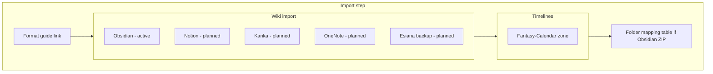

# Wizard import sections (wiki vs timelines)

## Recommendation: label better, don’t split flows

**Use two clear sections on one Import step**, not separate wizards, routes, or API fields.

| Approach | Fits today? | Why |
|----------|-------------|-----|
| **Labeled sections** (chosen) | Yes | Backend already has two pipelines: `markdownZipFile` → wiki/pages ([`campaignImportProcessor.ts`](backend/src/lib/campaignImportProcessor.ts)); `calendarConfigFile` → chronology ([`FantasyCalendarImportZone`](frontend/src/components/chronology/FantasyCalendarImportZone.tsx)). Users think in *what* they’re importing (wiki vs time), not in five parallel upload APIs. |
| **Fully separate imports** | Overkill now | Would imply multiple simultaneous files, separate mapping UIs, or step splits—none of which exist except one optional ZIP + one optional calendar JSON. |

Within **Wiki import**, separate **source cards** (Obsidian vs Notion vs …) are still right: they set expectations per tool while sharing one active upload slot until each parser ships.

**Esiana backup** belongs in Wiki import as **planned**: it will restore a prior Esiana export (`.zip` of wiki, templates, relations per [`todo.md`](todo.md) “Unified campaign backup engine”), not a third timeline type.

---

## Current state

Step 2 in [`frontend/src/components/hub/NewCampaignWizard.tsx`](frontend/src/components/hub/NewCampaignWizard.tsx) combines Obsidian+Notion in one “Markdown ZIP Import” card beside Fantasy Calendar in a 2-column grid—so wiki sources and timelines look like peers at the same level without category labels.

---

## Target layout

### Section 1 — Wiki import

Short intro: *Import pages, folders, and wiki structure from another tool or a previous Esiana export.*

| Source card | Status | Notes |
|-------------|--------|--------|
| **Obsidian** | Active | `.zip` vault export; existing `markdownZipInputRef` / `setMarkdownZip` / folder-mapping table |
| **Notion** | Planned | Non-clickable + Planned badge |
| **Kanka** | Planned | Non-clickable + Planned badge |
| **OneNote** | Planned | Non-clickable; aligns with todo “OneNote ingestion engine” |
| **Esiana backup** | Planned | Non-clickable; restore from future unified campaign `.zip` (todo Phase 5.5) |

Grid: responsive `sm:grid-cols-2` (5 cards: 2+2+1 or `lg:grid-cols-3` with last row spanning—pick what looks balanced in UI).

Only **Obsidian** shows “Choose .zip file” and selected-file state when `payload.imports.markdownZipFile` is set.

### Section 2 — Timelines

Section heading: **Timelines**  
Subtitle: *Import calendar and timeline configuration (not wiki pages).*

- Reuse [`FantasyCalendarImportZone`](frontend/src/components/chronology/FantasyCalendarImportZone.tsx) unchanged in behavior (`mode="preview"`, `calendarConfigFile`).
- Optionally pass a `className` or wrap so the zone visually sits inside the timelines section (border/heading hierarchy), not as a sibling “import type” mixed with Obsidian.

Folder-mapping table stays under Wiki import (only relevant after Obsidian ZIP).

---

## Implementation (frontend only)

**File:** [`frontend/src/components/hub/NewCampaignWizard.tsx`](frontend/src/components/hub/NewCampaignWizard.tsx)

1. **Structure** — Replace the `lg:grid-cols-2` wiki+calendar row with:
   - `<section>` or grouped `div` for **Wiki import** (heading + description + source card grid + hidden zip input + mapping table).
   - `<section>` for **Timelines** (heading + description + `FantasyCalendarImportZone`).

2. **Source cards** — Shared card styles; planned cards use `aria-disabled`, muted opacity, **Planned** pill, no `onClick`.

3. **Icons** — `SiObsidian`, `SiNotion` from `react-icons/si`; lucide fallbacks for Kanka / OneNote / Esiana backup (e.g. `Map`, `BookOpen`, `Archive` or app-consistent icon).

4. **Copy** — Remove “Obsidian or Notion” combined wording; wiki format-guide link stays above Wiki import.

5. **No API changes** — Still `markdownZipFile` + `calendarConfigFile`; no `importSource` field yet.

---

## Out of scope

- Notion / Kanka / OneNote / Esiana backup ingest backends
- Separate wizard steps per source
- Automated tests (none for wizard today)

---

## Manual check

1. Import step shows **Wiki import** then **Timelines** headings.
2. Five wiki cards; only Obsidian uploads ZIP and drives folder mapping.
3. Four planned cards (Notion, Kanka, OneNote, Esiana backup) are inert.
4. Fantasy-Calendar still selects JSON under Timelines.
5. Create campaign with Obsidian ZIP + calendar still succeeds.
