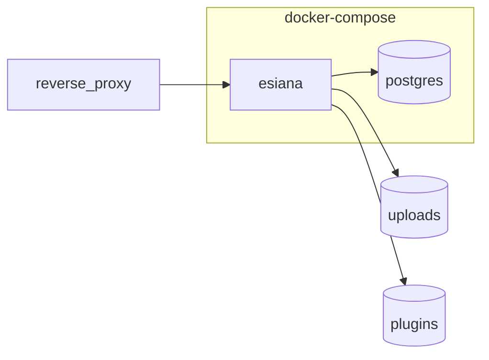

# Docker deployment

Compose services, images, volumes, and operational commands.

See [Installation](installation.md) for first-time setup.

Compose file: [compose.docker.example.yml](../options/compose.docker.example.yml) (minimal; optional env in [environment variables](../options/environment-variables.md)). Canonical copy: [`esiana-core/docker-compose.yml`](https://github.com/Esiana-ttrpg/esiana-core/blob/main/docker-compose.yml).

---

## Architecture



| Service | Image | Role |
|---------|-------|------|
| **esiana** | `ghcr.io/esiana-ttrpg/esiana:${ESIANA_VERSION:-latest}` | Node API + internal nginx (SPA, `/api`, `/uploads` on container port 80) |
| **postgres** | `postgres:16-alpine` | Database |

Startup order:

1. Postgres passes `pg_isready` healthcheck
2. Esiana entrypoint runs `prisma migrate deploy` (with retry)
3. Esiana serves on host port `8080` (mapped to container port 80)

---

## Useful commands

```bash
docker compose up -d              # first start or after config change
docker compose pull               # upgrade image (pin ESIANA_VERSION in .env first)
docker compose logs -f esiana
docker compose ps
docker compose down               # stop; volumes preserved
```

### Released image (GHCR)

Published image: `ghcr.io/esiana-ttrpg/esiana`

Set `ESIANA_VERSION` in `.env` to a release tag (e.g. `v1.0.7`) before pulling:

```bash
# In .env: ESIANA_VERSION=v1.0.7
docker compose pull
docker compose up -d
```

Omit `ESIANA_VERSION` to use `latest`.

> **Note:** Releases before the unified image used separate `esiana-backend` and `esiana-frontend` packages — deprecated; upgrade to `esiana` on your next tag pull.

---

## Volumes

| Volume | Mount | Contents |
|--------|-------|----------|
| `pgdata` | postgres | PostgreSQL data |
| `uploads` | `/data/uploads` | Maps, media |
| `plugins` | `/app/plugins` | Runtime plugin packages |

Data survives `docker compose down`. Use `docker compose down -v` only when you intend to wipe data.

---

## Optional integrations

Configure after the base install — do not block quick start.

| Integration | Where to configure |
|-------------|-------------------|
| **HTTPS / reverse proxy** | [Reverse proxy](reverse-proxy.md) |
| **OIDC / external sign-in** | [Federated identity](../options/federated-identity.md) — IdP details in Admin; set `AUTH_SECRETS_KEY` in production |
| **Plugins** | [Plugins overview](../features/plugins-overview.md), [System admin settings](../options/system-admin-settings.md) |
| **S3-compatible uploads** | [`esiana-core/docs/deployment/object-storage.md`](../../esiana-core/docs/deployment/object-storage.md) |

---

## API docs in production

`/api/docs` is enabled by default in Compose. Set `OPENAPI_DOCS_ENABLED=false` on public-facing hosts to hide Swagger.

---

## Troubleshooting

| Symptom | Cause | Fix |
|---------|-------|-----|
| `exec /entrypoint.sh: exec format error` on arm64 | **v1.0.5–v1.0.6:** UTF-8 BOM in entrypoint; **older tags:** amd64-only image | Upgrade to **v1.0.7+** |
| `ERR_MODULE_NOT_FOUND: @esiana/storage-s3` | **v1.0.6** packaging regression | Upgrade to **v1.0.7+** |
| CORS errors | External URL mismatch | Set `PUBLIC_ORIGIN` in `.env` to your public URL — see [Reverse proxy](reverse-proxy.md) |
| Login cookie not set | `COOKIE_SECURE=true` over plain HTTP | Use HTTPS or `COOKIE_SECURE=false` for local HTTP only |
| Postgres restart loop | `POSTGRES_PASSWORD` missing | Copy `.env.example` and set required secrets |
| Blank page / API errors | Migrations failed on startup | `docker compose logs esiana` |
| SPA blank but `/api/health` works | Internal nginx failed | `docker compose logs esiana`; confirm `ENABLE_INTERNAL_NGINX=true` |

Full operator runbook: [`esiana-core/docs/deployment/Docker Compose.md`](../../esiana-core/docs/deployment/Docker%20Compose.md)
