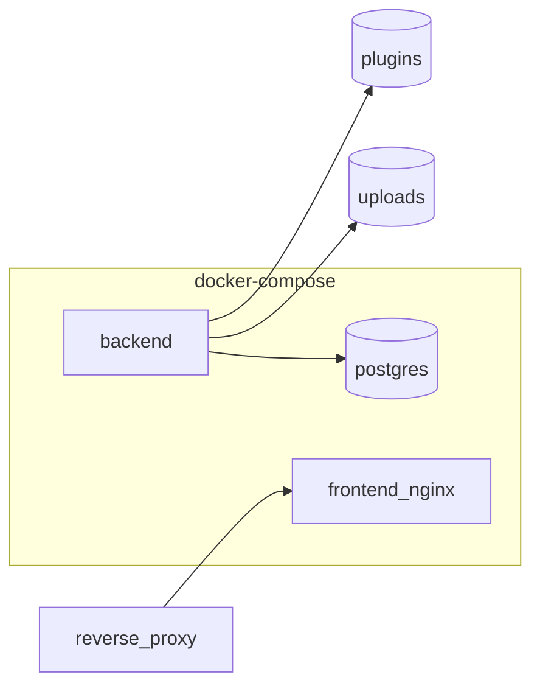

# Docker deployment

Compose services, images, volumes, and operational commands.

See [Installation](installation.md) for first-time setup.

---

## Architecture



| Service | Role |
|---------|------|
| **postgres** | Persistence (postgresql profile only) |
| **backend** | Express API, Prisma, uploads, plugins |
| **frontend** | nginx serving SPA; proxies `/api` and `/uploads` |

Startup order: Postgres healthcheck → `prisma migrate deploy` in backend entrypoint → API ready.

---

## Useful commands

```bash
docker compose logs -f backend
docker compose ps
docker compose down                    # stop; volumes preserved
docker compose pull && docker compose up -d   # upgrade images
```

---

## Volumes

| Volume | Contents |
|--------|----------|
| `pgdata` | PostgreSQL data |
| `uploads` | Maps, media |
| `plugins` | Runtime plugin packages |
| `esiana-data` | SQLite file (sqlite profile) |

---

## API docs in production

`/api/docs` is disabled in production unless `OPENAPI_DOCS_ENABLED=true`. The OpenAPI spec ships version-locked inside the backend image.

---

## Troubleshooting

| Symptom | Check |
|---------|-------|
| Blank page / API errors | `docker compose logs backend` — migration failed? |
| Login cookie not set | `COOKIE_SECURE=true` requires HTTPS |
| CORS errors | `CORS_ORIGIN` must match browser URL |
| Postgres restart loop | `POSTGRES_PASSWORD` set? |

Legacy detail: [Options: deployment & Docker](../options/deployment-and-docker.md) (redirect stub).
