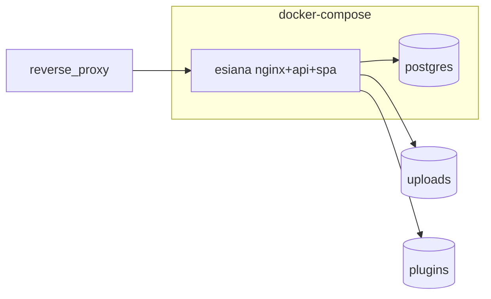

# Docker deployment

Compose services, images, volumes, and operational commands.

See [Installation](installation.md) for first-time setup.

---

## Architecture



| Service | Role |
|---------|------|
| **postgres** | PostgreSQL persistence |
| **esiana** | Single app image: nginx serves SPA and proxies `/api` + `/uploads` to Node backend on localhost |

Startup order:

1. Postgres passes `pg_isready` healthcheck
2. Esiana entrypoint runs `prisma migrate deploy` (with retry)
3. Backend passes `/api/health` on localhost
4. nginx starts and serves port 80 (mapped to host `8080` by default)

---

## Useful commands

```bash
docker compose up -d --build          # first start or rebuild from source
docker compose logs -f esiana
docker compose ps
docker compose down                    # stop; volumes preserved
```

### Released image (GHCR)

Published app image:

| Image | Registry path |
|-------|---------------|
| Esiana | `ghcr.io/esiana-ttrpg/esiana` |

Set `ESIANA_VERSION` to a release tag (e.g. `v1.0.1`) before pulling:

```bash
export ESIANA_VERSION=v1.0.1
docker compose pull
docker compose up -d
```

Omit `ESIANA_VERSION` to use `latest`. Local development can still build from source with `docker compose up -d --build` — compose defines both `image:` and `build:`.

> **Note:** Releases before the unified image used separate `esiana-backend` and `esiana-frontend` packages — deprecated; upgrade to `esiana` on your next tag pull.

---

## Volumes

| Volume | Contents |
|--------|----------|
| `pgdata` | PostgreSQL data |
| `uploads` | Maps, media |
| `plugins` | Runtime plugin packages |

---

## API docs in production

`/api/docs` is disabled in production unless `OPENAPI_DOCS_ENABLED=true`. The OpenAPI spec ships version-locked inside the esiana image. Access via your public origin (e.g. `http://localhost:8080/api/docs`).

---

## Troubleshooting

| Symptom | Check |
|---------|-------|
| Blank page / API errors | `docker compose logs esiana` — migration or backend start failed? |
| App stuck starting | `docker compose ps` — healthcheck waiting on migrate or backend |
| Login cookie not set | `COOKIE_SECURE=true` requires HTTPS |
| CORS errors | `CORS_ORIGIN` must match browser URL |
| Postgres restart loop | `POSTGRES_PASSWORD` set? |

Legacy detail: [Options: deployment & Docker](../options/deployment-and-docker.md) (redirect stub).
